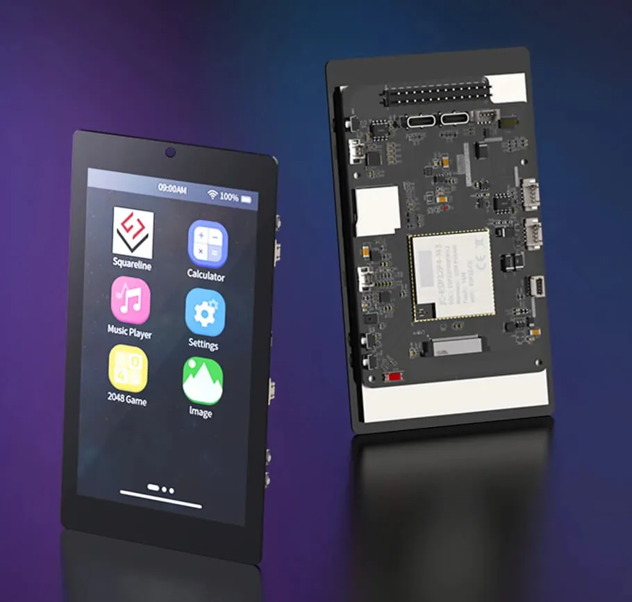
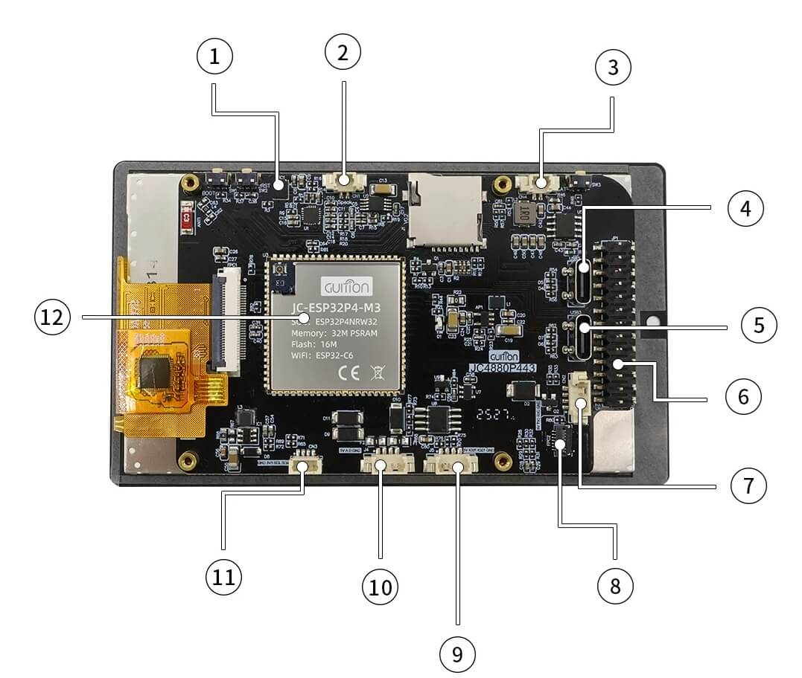
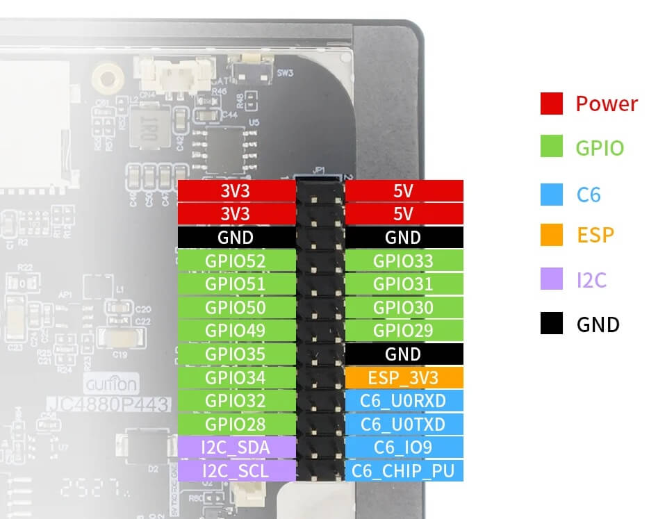

# GUITION JC4880P443C_I_W Device Specifications

**Board Name:** Guition JC4880P443C_I_W
**Module:** JC-ESP32P4-M3-C6

## Overview

4.3-inch touch display board featuring ESP32-P4 + ESP32-C6 module with camera and speaker support.

## Core Module

### ESP32-P4 (Main SoC)

| Parameter     | Value                                |
|---------------|--------------------------------------|
| CPU           | Dual-core 32-bit RISC-V HP @ 400 MHz |
| AI Extensions | Yes, with FPU                        |
| LP MCU        | Single-core @ 40 MHz                 |
| HP L2MEM      | 768 KB                               |
| LP SRAM       | 32 KB                                |
| TCM           | 8 KB                                 |  
| PSRAM         | 32 MB                                |
| HP ROM        | 128 KB                               |
| LP ROM        | 16 KB                                |
| GPU           | 2D Pixel Processing Accelerator      |
| VPU           | H.264 and JPEG codec support         |

### ESP32-C6 (Wireless SoC)

| Parameter | Value                            |
|-----------|----------------------------------|
| WiFi      | WiFi 6 (802.11ax)                |
| Bluetooth | Bluetooth 5 (LE)                 |
| 802.15.4  | Zigbee / Thread support          |
| Flash     | 16 MB NOR Flash                  |
| Antenna   | IPEX connector + ceramic antenna |

## Display

| Parameter  | Value                  |
|------------|------------------------|
| Size       | 4.3 inches             |
| Resolution | 480 x 800 pixels       |
| Type       | IPS                    |
| Touch      | Capacitive touchscreen |
| Interface  | MIPI-DSI               |

## Interfaces

| Interface | Details                              |
|-----------|--------------------------------------|
| USB       | 2x USB 2.0 Type-C                    |
| Serial    | UART (0, 1) + 4-pin RS-485 connector |
| Camera    | MIPI CSI connector                   |
| Storage   | MicroSD card slot                    |
| GPIO      | 26-pin header (2.54mm pitch)         |

## GPIO Header Capabilities

- I2C
- SPI
- PWM
- ADC
- RMT
- MCPWM
- TWAI (CAN)
- LEDC

## Audio

- Microphone connector
- Speaker connector

## Security Features

- Hardware key management unit
- Digital signature engine
- Flash encryption
- Secure boot

## Physical

| Parameter         | Value                    |
|-------------------|--------------------------|
| Board Dimensions  | 114.4 x 66.8 mm          |
| Module Dimensions | 27 x 27 x 3.4 mm         |
| Operating Temp    | -20°C to +70°C           |
| Power             | USB-C or lithium battery |

## Board Layout

### Connectors

| #  | Connector | Type        | Description                           |
|----|-----------|-------------|---------------------------------------|
| 1  | MIC       | Jack        | Microphone input                      |
| 2  | SPEAK     | MX 1.25 2P  | Speaker output                        |
| 3  | BAT       | MX 1.25 2P  | Li-ion battery input                  |
| 4  | USB1      | USB Type-C  | Full-speed USB (CH340C UART bridge)   |
| 5  | USB3      | USB Type-C  | High-speed native USB                 |
| 6  | GPIO      | 2x13 header | 26-pin GPIO header (2.54mm pitch)     |
| 7  | UART0     | MX 1.25 4P  | UART0 connector                       |
| 8  | CAM       | FPC         | MIPI CSI camera interface             |
| 9  | UART      | MX 1.25 4P  | Additional UART connector             |
| 10 | RS485     | MX 1.25 4P  | RS-485 interface                      |
| 11 | I2C       | HS 1.0 2P   | I2C connector                         |
| 12 | -         | -           | Main processor module (ESP32-P4 + C6) |

## GPIO Pinout

## Inter-Chip Communication (P4 ↔ C6)

The ESP32-P4 and ESP32-C6 communicate via **ESP-HOSTED** over SDIO interface.

### SDIO Pin Mapping (P4 side)

| Signal    | GPIO   |
|-----------|--------|
| SDIO_D0   | GPIO14 |
| SDIO_D1   | GPIO15 |
| SDIO_D2   | GPIO16 |
| SDIO_D3   | GPIO17 |
| SDIO_CLK  | GPIO18 |
| SDIO_CMD  | GPIO19 |
| C6_RESET  | GPIO54 |

### C6 UART0 Pins (for debugging/programming)

| Signal     | Module Pin | P4 GPIO          |
|------------|------------|------------------|
| C6_U0RXD   | Pin 16     | GPIO11           |
| C6_U0TXD   | Pin 17     | Not routed to P4 |
| C6_CHIP_PU | External   | -                |

**Note:** C6 UART0 is not directly exposed to external USB. C6 firmware is typically:
1. Pre-flashed at factory with ESP-HOSTED slave firmware
2. Updated via SDIO OTA from P4

### I2C Bus (Shared)

| Device        | Address   | GPIO                 |
|---------------|-----------|----------------------|
| Touch GT911   | 0x5D/0x14 | SDA=GPIO7, SCL=GPIO8 |
| Audio ES8311  | 0x18      | SDA=GPIO7, SCL=GPIO8 |

## Display Configuration

### MIPI-DSI Parameters

| Parameter    | Value            |
|--------------|------------------|
| Lanes        | 2 data lanes     |
| Pixel Format | RGB565 or RGB888 |
| DPI Clock    | 40 MHz           |
| PHY LDO      | Channel 3, 2500mV|

### Timing (480x800)

| Parameter      | Value |
|----------------|-------|
| H Back Porch   | 40    |
| H Front Porch  | 40    |
| H Sync Width   | 4     |
| V Back Porch   | 16    |
| V Front Porch  | 16    |
| V Sync Width   | 4     |

## Touch Controller

| Parameter  | Value       |
|------------|-------------|
| Controller | Goodix GT911|
| Interface  | I2C         |
| I2C SDA    | GPIO7       |
| I2C SCL    | GPIO8       |
| RST Pin    | GPIO22      |
| INT Pin    | GPIO21      |

## Audio Codec

| Parameter | Value  |
|-----------|--------|
| Codec     | ES8311 |
| I2S MCLK  | GPIO13 |
| I2S WS    | GPIO10 |
| I2S BCLK  | GPIO12 |
| I2S DIN   | GPIO48 |
| I2S DOUT  | GPIO9  |
| PA Enable | GPIO11 |

## USB Configuration

| Port | Type           | Connection                       |
|------|----------------|----------------------------------|
| USB1 | Full-speed USB | P4 GPIO42/43 + CH340C (USB-TTL)  |
| USB3 | High-speed USB | P4 native USB (ESP_USB_P/N)      |

The CH340C provides USB-to-UART bridge for P4 UART0 programming.

## Programming

### ESP32-P4 Flashing

- Interface: USB-TTL via CH340C (USB1 port)
- Tool: esptool.py or ESP Flash Download Tool
- Mode: Select "ESP32-P4", "Develop", "UART"
- Flash address: 0x0000

### ESP32-C6 Flashing

- **Direct access not available** - C6 UART0 is internal to module
- Options:
  1. Use pre-flashed ESP-HOSTED slave firmware
  2. Update via P4 UART bridge (requires custom P4 firmware)
  3. SDIO OTA update through P4

## Development

- Framework: ESP-IDF (5.4+)
- GUI: LVGL 9.x, SquareLine Studio
- Tools: GUITION Designer
- esp_hosted: For P4 ↔ C6 WiFi/BT communication

## Resources

- [Manufacturer Website](https://guition.com/)
- [Product Page](https://guition.com/product/esp32-p4-4-3-inch-ips-display-480-800-capacitive-touch-screen-wifi6-bluetooth5-development-board/)
- [Manufacturer Documentation (Baidu)](https://pan.baidu.com/s/1fqkjqAjtRgjDFDk5PtOtpQ?pwd=GCJC) - Schematics, datasheets, sample code
- [ESP32-P4 Datasheet](https://www.espressif.com/sites/default/files/documentation/esp32-p4_datasheet_en.pdf)
- [ESP32-C6 Datasheet](https://www.espressif.com/sites/default/files/documentation/esp32-c6_datasheet_en.pdf)

## Image Credits

Device images from [tranzystor.pl](https://www.tranzystor.pl/nowosci-ze-swiata/esp32p4-z-ekranem-dotykowym-ips-o-przekatnej-43-cala.html)
